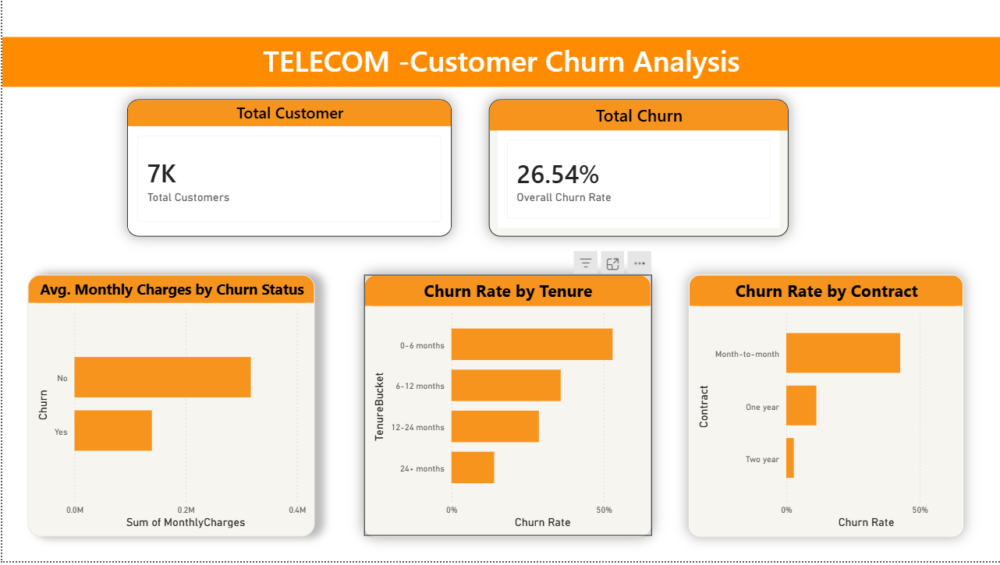
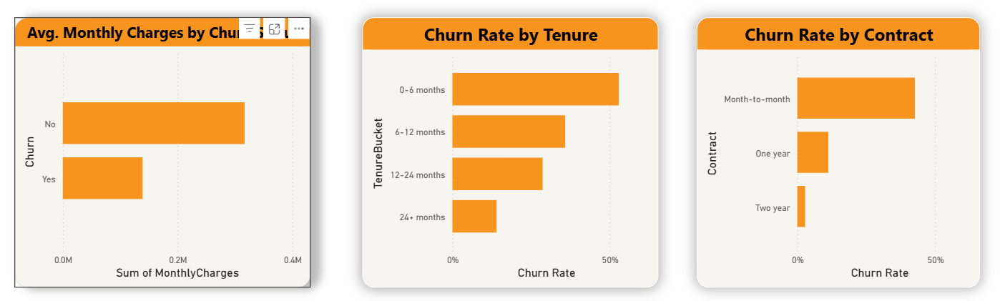

# telecom-customer-churn-analysis
Customer churn analysis using Python, SQL, and Power BI

# Customer Churn Analysis – Telecom Case Study

## Overview
This project analyzes customer churn in a telecom dataset of 7,044 customers using Python, SQL, and Power BI.

## Business Context
Customer churn directly impacts recurring revenue. This analysis identifies key churn drivers and high-risk customer segments.

## Tools Used
- Python (Pandas, NumPy)
- SQL Server
- Power BI

## Key Insights
- Overall churn rate ~26.5%
- Month-to-month contracts show the highest churn (~43%)
- Over 50% of churn occurs in the first 6 months
- Churned customers have higher average monthly charges

## Dashboard

## Next Steps
- Extend analysis to include retention strategies
- Add churn prediction modeling

